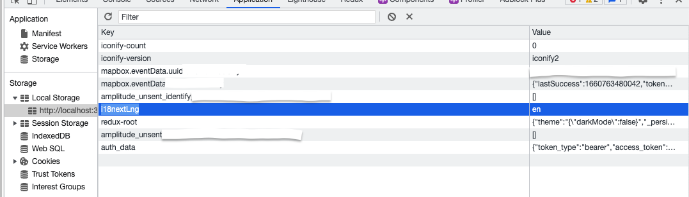

# React CheatSheet

- [React CheatSheet](#react-cheatsheet)
  - [create-react-app with typescript support](#create-react-app-with-typescript-support)
  - [Typescript - adding aliases to project](#typescript---adding-aliases-to-project)
    - [Using `@craco/craco` package](#using-cracocraco-package)
    - [Using `react-app-rewired` and `customize-cra`](#using-react-app-rewired-and-customize-cra)
  - [React-app-rewired CheatSheet](#react-app-rewired-cheatsheet)
  - [Configuring storybook](#configuring-storybook)
  - [Testing](#testing)
  - [Localization](#localization)
    - [Library i18n](#library-i18n)
      - [Installation](#installation)
      - [Usage](#usage)
        - [Through special hook in components](#through-special-hook-in-components)
        - [Components with parameters binding](#components-with-parameters-binding)
        - [Directional way, through utility](#directional-way-through-utility)
      - [Tips and tricks](#tips-and-tricks)

## create-react-app with typescript support  

```shell
npx create-react-app my-app --template typescript
```

## Typescript - adding aliases to project

It is very important to have consistent import statements in your react projects, and to preserve relative paths hell, ex. `../../../utils/smth.ts` looks much more ugly than `~/utils/smth.ts`.

Unfortunately, latest versions of typescript support this trick worse and worse (I don't know why, in fact).

### Using `@craco/craco` package

Steps for installation:

1. `yarn add @craco/craco`
2. Make file `craco.config.js` in root of project
3. Put text below to `craco.config.js`:

   ```javascript
    const path = require('path');
    module.exports = {
    webpack: {
        alias: {
        '~': path.resolve(__dirname, 'src'),
        },
    },
    };
   ```

4. Change react scripts in `package.json` to:

   ```javascript
    "scripts": {
        "start": "craco start",
        "build": "craco build",
        "test": "craco test",
        "eject": "craco eject"
    }
   ```

5. Start project and check everything works: `yarn start`

### Using `react-app-rewired` and `customize-cra`

Steps for installation:

1. `yarn add react-app-rewired`
2. `yarn add  customize-cra`
3. In `config-overrides.js` add those lines:

   ```javascript
   const { addWebpackAlias } = require('customize-cra');
   const path = require('path');

   //... in module.export of configuration section:
   addWebpackAlias({
    '~': path.resolve(__dirname, './src'),
    // ...
   })
   ```

4. And font forget to add similar aliases to `tsconfig.json`:

   ```javascript
    "paths": {
      "~/*": [
        "./src/*"
      ],
    },
   ```

## React-app-rewired CheatSheet

Available here in separate document - [link](./config/react-app-rewired/readme.md)

## Configuring storybook

- Install dependencies

```js
yarn install @storybook/react @types/storybook__react @storybook/preset-create-react-app @storybook/builder-webpack5 @storybook/manager-webpack5
```

- Add command to `package.json`

```js
"storybook": "NODE_OPTIONS='--openssl-legacy-provider' start-storybook -p 9009 -s public" 
```

- Create folder `.storybook` in root of your project
- Create file `.storybook/preview.tsx` with content:

```js
import React from 'react'
import { configure, addDecorator } from "@storybook/react";
import { TestProvider } from '../src/utils/tests';
import { store } from '../src/redux/store';

const req = require.context("../src", true, /\.stories\.tsx$/);

function loadStories() {
    req.keys().forEach(req);
}

// Test provider contains all necessary react contexts for proper application work, such as redux context, @mui/theme provider, and so on
addDecorator(S =>
     <TestProvider store={store}><S /></TestProvider>
 );

configure(loadStories, module);

```

- Create file `.storybook/main.js` with content:

```js
const path = require('path');

module.exports = {
  addons: [
    '@storybook/preset-create-react-app'
  ],
  core: {
    builder: 'webpack5',
  },
  // feel free to modify webpack config here as well
  webpackFinal: async (config) => {
    config.module.rules.push({
      test: /\.mjs$/,
      include: /node_modules/,
      type: "javascript/auto",
    });

    // my custom alias for pretty-path module resolution. ~ sign points to root of src folder
    config.resolve.alias['~'] = path.resolve(__dirname, '../src');

    return config;
  }
}
```

## Testing

Separate document available in [testing/readme.md]( ./testing )

## Localization

### Library i18n

Commonly used library and approach for localization.

#### Installation

- Install packages

  ```shell
  yarn add i18next i18next-browser-languagedetector i18next-xhr-backend
  ```

- Take a look at configuration file [config/i18n/i18n.ts](./config/i18n/i18n.ts). Include it to your project somewhere

- In `index.tsx` import previously added `i18n.ts`
- Put translation files in `public/locales/${LOCALIZATION_NAME}/translation.json`

#### Usage

##### Through special hook in components

```js
import { useTranslation } from 'react-i18next';
///...

const Component: React.FC = () => {
  const { t } = useTranslation();

  ///...
  return (
    <TextField
      fullWidth
      type="email"
      label={t('Email address')}
      InputLabelProps={{
        shrink: true
      }}
      {...getFieldProps('email')}
      error={Boolean(touched.email && errors.email)}
      helperText={touched.email && errors.email}
    />
  )
}
```

##### Components with parameters binding

```js
    // in functional component
    <Trans i18nKey="View all images" values={{ total }} />

    // in locales/en/translation.json
    {
      //...
      "View all images": "View all {{total}} images",
      //...
    }

    // in locales/cn/translation.json
    {
      //...
      "View all images": "查看所有 {{total}} 張圖片",
      //...
    }
```

##### Directional way, through utility

This is useful if you have string to localize in some objects (not functional components)

```js
// importing file from ./config/18n/i18n.ts
import i18n from '~/utils/i18n';

const messages = {
  hello: i18n.t('world')
}
```

#### Tips and tricks

For changing translation, you have to change value in browser local storage named `i18nextLng`



or use this command in console:

```js
localStorage.setItem("i18nextLng", "cn")
```

Refresh the page after to see new site localization applied
